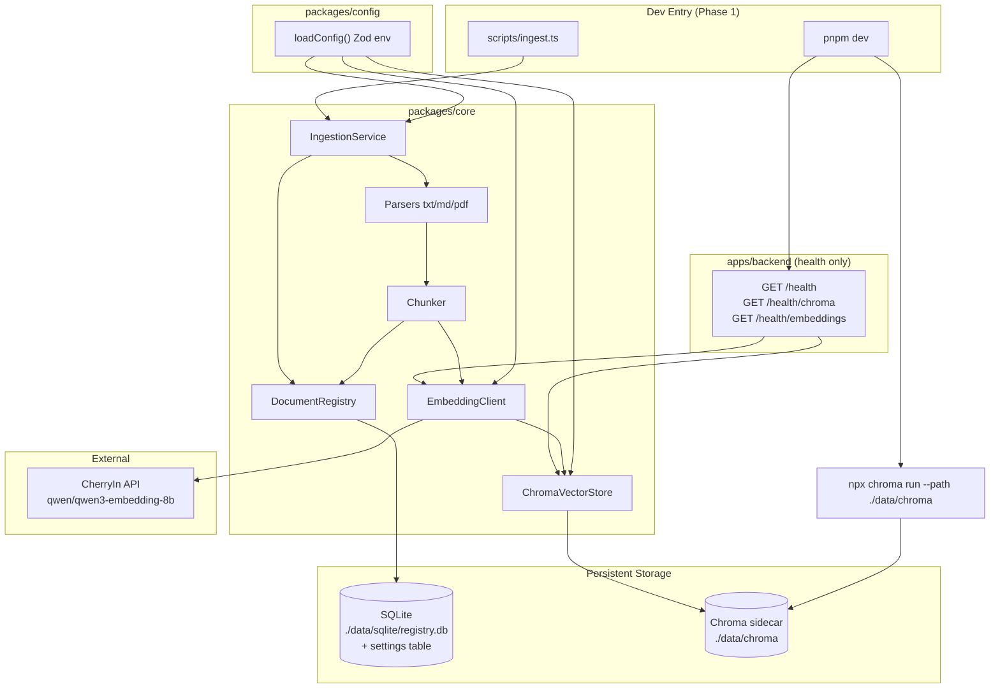

# Phase 1: Platform Foundation & Ingestion - Research

**Researched:** 2026-06-29
**Domain:** TypeScript monorepo scaffold, Chroma sidecar, CherryIn embeddings, document ingestion pipeline
**Confidence:** HIGH (Chroma, LangChain splitters, OpenAI embed API limits verified); MEDIUM (CherryIn-specific behavior, token encoding proxy)

<user_constraints>
## User Constraints (from CONTEXT.md)

### Locked Decisions

#### Chunking Strategy (discussed)
- **D-01:** Default chunk size = **1024 tokens** (~4000 characters)
- **D-02:** Default overlap = **15%** (~150 tokens)
- **D-03:** Markdown uses **fixed sliding window** in v1 (same as txt/PDF); heading-aware chunking deferred to v1.x
- **D-04:** Chunk configuration must be **editable via Web UI** (Phase 4); Phase 1 establishes persisted `ChunkConfig` with env bootstrap defaults
- **D-05:** Web-saved chunk settings apply to **subsequent ingests only** (existing vectors not auto-reindexed unless explicitly triggered later)

#### Configuration Persistence (derived from D-04)
- **D-06:** Store `ChunkConfig` (size, overlap) in SQLite settings table (or equivalent persisted store) readable by ingestion pipeline
- **D-07:** Environment variables (`CHUNK_SIZE`, `CHUNK_OVERLAP`) provide **initial defaults** on first run before any Web UI edit

### Claude's Discretion

- **Monorepo layout:** pnpm + Turborepo with `packages/core` (domain logic), `packages/config` (Zod env), thin apps deferred to later phases; Phase 1 focuses on core + dev scripts
- **Document registry:** SQLite (`better-sqlite3`) for document metadata alongside Chroma vectors
- **Phase 1 ingest entrypoint:** Dev CLI/script invoking `IngestionService` directly (no REST until Phase 2)
- **Data paths:** `./data/chroma` (Chroma persistence), `./data/sqlite` (registry/settings)
- **Dev UX:** `pnpm dev` starts Chroma sidecar via `concurrently` + health probe script
- **PDF rejection threshold:** Reject when extracted text < 50 characters OR < 10% of page count (whichever stricter); English error messages in v1 scaffold

### Deferred Ideas (OUT OF SCOPE)

#### From discussion (other gray areas not selected)
- Monorepo package split granularity — use research default unless planner identifies issues
- PDF page-aware chunking vs unified window — unified window for v1
- Heading-aware markdown chunking — v1.x enhancement

#### Web UI chunk config (Phase 4 scope)
- Settings page UI for chunk size/overlap lives in Phase 4; Phase 1 only needs persisted schema + env defaults
</user_constraints>

<phase_requirements>
## Phase Requirements

| ID | Description | Research Support |
|----|-------------|------------------|
| CONF-01 | All secrets and service URLs load from environment variables / `.env` | `packages/config` Zod schema + `dotenv` in dev scripts; never import secrets in committed files |
| CONF-02 | `.env.example` documents required configuration without secrets | Template env vars: `CHERRYIN_API_KEY`, `CHERRYIN_BASE_URL`, `CHROMA_HOST`, `CHROMA_PORT`, `CHUNK_SIZE`, `CHUNK_OVERLAP`, `SQLITE_PATH`, `DATA_DIR` |
| CONF-04 | When auth is disabled, backend binds to localhost-friendly dev defaults | Health-only Fastify binds `127.0.0.1`; Chroma sidecar on `localhost:8000`; no auth in Phase 1 |
| INGE-01 | Operator can ingest txt files | `TxtParser` → unified chunker → embed → Chroma upsert |
| INGE-02 | Operator can ingest markdown files | `gray-matter` strips frontmatter; same sliding-window chunker as txt |
| INGE-03 | Operator can ingest text-layer PDF files | `pdf-parse` extraction → same chunker |
| INGE-04 | System rejects PDFs with insufficient extractable text | Validate `< 50 chars` OR `< 10% page count` (stricter); fail before embed |
| INGE-05 | Ingested documents are chunked with configurable size and overlap | `ChunkConfig` from SQLite (env bootstrap); `TokenTextSplitter` reads runtime config |
| INGE-06 | Chunks embedded via CherryIn `qwen/qwen3-embedding-8b` | Shared `EmbeddingClient` via `openai` SDK + `baseURL`; batch embed with retry |
| INGE-07 | Vectors persist in local Chroma and survive restart | `npx chroma run --path ./data/chroma` sidecar; verify restart test |
| INGE-08 | Re-ingesting replaces prior chunks without orphan vectors | Delete-by-`document_id` metadata filter, then upsert; stable `{document_id}:{chunk_index}` IDs |
| INGE-09 | Default single collection with optional `collection` param reserved | `DEFAULT_COLLECTION = "default"`; `IngestionService.ingest(path, { collection? })` signature only |
| API-05 | Backend exposes health/status endpoints for Chroma and embedding connectivity | Minimal `apps/backend` with `/health` only (see Open Questions — reconciles with no-REST ingest) |
</phase_requirements>

## Summary

Phase 1 delivers a **greenfield TypeScript monorepo** with shared config, a Chroma HTTP sidecar, SQLite-backed document registry + settings, and a complete **parse → chunk → embed → store** pipeline callable from a dev ingest script. No application code exists yet; all patterns come from project research (SUMMARY.md, STACK.md, ARCHITECTURE.md, PITFALLS.md) verified against current npm and official docs on 2026-06-29.

The highest-risk decisions are **not framework choice** but data-plane correctness: Chroma must run in **server mode** from day one (JS client is REST-only) [CITED: docs.trychroma.com/docs/run-chroma/clients]; embeddings must be **precomputed** on every upsert [CITED: docs.trychroma.com/docs/collections/add-data]; re-ingest must **delete-then-upsert** by stable `document_id` to avoid orphan vectors [CITED: cookbook.chromadb.dev/core/collections]. Chunk size is locked at **1024 tokens / 15% overlap** — use `TokenTextSplitter`, not character-based `RecursiveCharacterTextSplitter`, because user decisions specify tokens [CITED: docs.langchain.com/oss/javascript/integrations/splitters/split_by_token].

CherryIn API specifics (batch limits, rate limits, instruction prefix behavior via OpenAI-compatible endpoint) remain **MEDIUM confidence** — implement conservative batching (≤100 chunks/request) with exponential backoff on 429, and smoke-test during Phase 1 execution. Qwen3 retrieval instruction prefix applies to **query** embeddings only; document/chunk embeddings use raw text [CITED: huggingface.co/Qwen/Qwen3-Embedding-8B].

**Primary recommendation:** Scaffold `packages/config` + `packages/core` first, stand up Chroma sidecar + minimal health backend, then implement `IngestionService` with SQLite registry, token chunker, CherryIn embed client, and Chroma adapter — expose via `scripts/ingest.ts` and `pnpm dev` orchestration.

## Architectural Responsibility Map

| Capability | Primary Tier | Secondary Tier | Rationale |
|------------|-------------|----------------|-----------|
| Env/config validation | API / Backend (`packages/config`) | Dev scripts | Single Zod schema loaded at process boot; all services read same contract |
| ChunkConfig persistence | Database / Storage (SQLite) | API (future Phase 4 write) | Settings table owned by registry DB; ingestion reads, Web UI writes in Phase 4 |
| Document metadata registry | Database / Storage (SQLite) | — | List/delete scope, ingest status, chunk ID tracking — not in Chroma alone |
| Vector storage | Database / Storage (Chroma sidecar) | API / Core adapter | HTTP-only JS client; one sidecar process, many HTTP clients |
| Text parsing (txt/md/pdf) | API / Backend (`packages/core`) | — | Pure transformation; no browser involvement |
| Token chunking | API / Backend (`packages/core`) | — | Business logic; reads ChunkConfig from SQLite |
| Embedding generation | API / Backend (`packages/core`) | External CherryIn API | Outbound HTTP to CherryIn; shared module for ingest + future search |
| Ingest orchestration | API / Backend (`packages/core`) | Dev CLI script | `IngestionService` coordinates parse/chunk/embed/store |
| Chroma sidecar lifecycle | Dev orchestration (root scripts) | — | `concurrently` starts `npx chroma run`; not embedded in Node |
| Health/status probes | API / Backend (minimal Fastify) | Dev scripts | API-05 requires HTTP endpoints; Chroma `heartbeat()` + embed smoke test |
| Operator ingest entrypoint | Dev CLI script | — | Phase 1: direct `IngestionService` call; REST upload deferred Phase 2 |

## Standard Stack

### Core

| Library | Version | Purpose | Why Standard |
|---------|---------|---------|--------------|
| Node.js | 24.x LTS (`v24.13.0` verified) | Runtime | Active LTS; matches `@types/node@^24` [VERIFIED: node --version] |
| TypeScript | 6.x | Language | Project standard; MCP ecosystem TS-first [ASSUMED: matches STACK.md] |
| pnpm | 11.x | Workspaces | Strict monorepo dependency graph [CITED: STACK.md]; install required on dev machine |
| Turborepo | 2.10.0 | Build cache | `dependsOn: ["^build"]` across packages [VERIFIED: npm registry] |
| chromadb | 3.4.3 | Vector client | Official JS v3; REST-only; explicit embeddings [VERIFIED: npm registry] [CITED: docs.trychroma.com] |
| openai | 6.45.0 | CherryIn client | OpenAI-compatible `/v1/embeddings` with `baseURL` override [VERIFIED: npm registry] |
| zod | 4.4.3 | Config validation | Shared env schema in `packages/config` [VERIFIED: npm registry] |
| better-sqlite3 | 12.11.1 | Registry + settings | Sync SQLite for doc metadata and ChunkConfig [VERIFIED: npm registry] |
| @langchain/textsplitters | 1.0.1 | Token chunking | `TokenTextSplitter` for 1024-token windows [VERIFIED: npm registry] [CITED: langchain docs] |
| pdf-parse | 2.4.5 | PDF text extraction | Text-layer only; lighter than pdfjs-dist [VERIFIED: npm registry] |
| gray-matter | 4.0.3 | MD frontmatter | Strip YAML before chunking [CITED: STACK.md] |
| fastify | 5.9.0 | Health endpoints | Minimal `/health` for API-05; full REST in Phase 2 [VERIFIED: npm registry] |
| dotenv | 17.x | Dev env loading | Load `.env` in dev scripts [CITED: STACK.md] |
| tsx | 4.x | Dev execution | Run TS without build step [CITED: STACK.md] |
| concurrently | 10.0.3 | Dev orchestration | Chroma sidecar + backend + health [VERIFIED: npm registry] |

### Supporting

| Library | Version | Purpose | When to Use |
|---------|---------|---------|-------------|
| vitest | 4.1.9 | Unit tests | Parser, chunker, ID strategy, PDF rejection [VERIFIED: npm registry] |
| tiktoken (via textsplitters) | bundled | Token counting | `TokenTextSplitter` encoding; default `cl100k_base` [CITED: langchain docs] |

### Alternatives Considered

| Instead of | Could Use | Tradeoff |
|------------|-----------|----------|
| `TokenTextSplitter` | `RecursiveCharacterTextSplitter` | User locked token-based sizing (D-01); character splitter violates requirement |
| `TokenTextSplitter` | Custom tiktoken wrapper | More control over Qwen tokenizer; higher effort — defer unless cl100k_base drift observed |
| Minimal Fastify health app | Health-only CLI script | CLI satisfies dev UX but not API-05 HTTP requirement — use thin Fastify |
| Fine-grained packages (`parsers/`, `embeddings/`) | Single `packages/core` | CONTEXT discretion favors simpler start; extract when file count grows |

**Installation:**

```bash
# Root
pnpm init
pnpm add -D turbo typescript tsx vitest concurrently @types/node eslint

# packages/config
pnpm add --filter @kb/config zod dotenv

# packages/core
pnpm add --filter @kb/core chromadb openai zod @langchain/textsplitters pdf-parse gray-matter better-sqlite3

# apps/backend (health only in Phase 1)
pnpm add --filter @kb/backend fastify @kb/core @kb/config
```

**Version verification (2026-06-29):** `chromadb@3.4.3`, `openai@6.45.0`, `@langchain/textsplitters@1.0.1`, `pdf-parse@2.4.5`, `better-sqlite3@12.11.1`, `zod@4.4.3`, `turbo@2.10.0`, `concurrently@10.0.3`, `fastify@5.9.0`, `vitest@4.1.9` — all confirmed via `npm view`. Note: STACK.md cites `@langchain/textsplitters@1.0.22` which does not exist on npm; use **1.0.1**.

## Architecture Patterns

### System Architecture Diagram



### Recommended Project Structure

```
kb-mcp-server/
├── apps/
│   └── backend/                 # Phase 1: health routes only; CRUD in Phase 2
│       └── src/
│           ├── index.ts         # Fastify listen 127.0.0.1
│           └── routes/health.ts
├── packages/
│   ├── config/
│   │   └── src/
│   │       ├── env.ts           # Zod schema
│   │       └── constants.ts     # DEFAULT_COLLECTION, embedding dims
│   └── core/
│       └── src/
│           ├── ingestion/
│           │   ├── ingestion-service.ts
│           │   ├── chunker.ts
│           │   └── parsers/
│           ├── embeddings/
│           │   └── embedding-client.ts
│           ├── vector-store/
│           │   └── chroma-store.ts
│           └── registry/
│               ├── document-registry.ts
│               └── schema.sql
├── scripts/
│   ├── ingest.ts                # Dev CLI: ingest file/path
│   └── wait-for-chroma.ts       # Health probe for concurrently
├── data/                        # gitignored
│   ├── chroma/
│   └── sqlite/
├── pnpm-workspace.yaml
├── turbo.json
├── package.json
└── .env.example
```

### Pattern 1: Chroma Server Mode + Explicit Embeddings

**What:** Run Chroma as separate HTTP process; pass precomputed embeddings on every write and query.

**When to use:** Always for Node.js — JS client has no `PersistentClient` [CITED: docs.trychroma.com/docs/run-chroma/clients].

**Example:**

```typescript
// Source: https://docs.trychroma.com/docs/collections/add-data
await collection.upsert({
  ids: chunkIds,
  embeddings: vectors,
  documents: texts,
  metadatas: metadatas,
});
```

### Pattern 2: Delete-Before-Upsert Re-Ingest

**What:** On re-ingest, delete all vectors for `document_id`, then upsert new chunks with stable IDs.

**When to use:** INGE-08 — prevents orphan vectors [CITED: cookbook.chromadb.dev/core/collections].

**Example:**

```typescript
// Source: https://cookbook.chromadb.dev/core/collections
await collection.delete({ where: { document_id: docId } });
await collection.upsert({ ids, embeddings, documents, metadatas });
```

### Pattern 3: Token-Based Sliding Window Chunker

**What:** Split all formats with `TokenTextSplitter` using runtime `ChunkConfig`.

**When to use:** INGE-05 with D-01/D-03 locked decisions.

**Example:**

```typescript
// Source: https://docs.langchain.com/oss/javascript/integrations/splitters/split_by_token
import { TokenTextSplitter } from "@langchain/textsplitters";

const splitter = new TokenTextSplitter({
  encodingName: "cl100k_base",
  chunkSize: config.chunkSize,      // default 1024
  chunkOverlap: config.chunkOverlap // default 154 (15% of 1024)
});
const chunks = await splitter.splitText(normalizedText);
```

### Pattern 4: SQLite Settings Bootstrap

**What:** On first boot, seed `settings` table from env if no row exists; ingestion reads latest values.

**When to use:** D-06/D-07 — Web UI writes same table in Phase 4.

**Example:**

```typescript
// Pattern: upsert-if-missing on startup
const existing = db.prepare("SELECT chunk_size, chunk_overlap FROM settings WHERE id = 1").get();
if (!existing) {
  db.prepare("INSERT INTO settings (id, chunk_size, chunk_overlap) VALUES (1, ?, ?)")
    .run(env.CHUNK_SIZE, env.CHUNK_OVERLAP);
}
export function getChunkConfig(): ChunkConfig {
  return db.prepare("SELECT chunk_size, chunk_overlap FROM settings WHERE id = 1").get();
}
```

### Pattern 5: Shared Embedding Client (Ingest + Future Search)

**What:** Single module wraps CherryIn; `embedDocuments()` uses raw text; `embedQuery()` prepends Qwen3 instruction prefix.

**When to use:** Phase 1 ingest uses `embedDocuments`; Phase 2 search uses `embedQuery` — same client prevents mismatch (Pitfall 3).

**Example:**

```typescript
// Source: https://huggingface.co/Qwen/Qwen3-Embedding-8B
const RETRIEVAL_TASK = "Given a user question, retrieve relevant passages from the knowledge base";

function formatQuery(text: string): string {
  return `Instruct: ${RETRIEVAL_TASK}\nQuery:${text}`;
}

async embedDocuments(texts: string[]): Promise<number[][]> {
  const res = await this.client.embeddings.create({
    model: "qwen/qwen3-embedding-8b",
    input: texts,
    dimensions: 1024,
  });
  return res.data.sort((a, b) => a.index - b.index).map(d => d.embedding);
}
```

### Anti-Patterns to Avoid

- **Embedded Chroma in Node:** JS has no in-process persistent client — use sidecar [CITED: docs.trychroma.com].
- **Character chunker for token-locked config:** Violates D-01; `RecursiveCharacterTextSplitter` measures characters [CITED: langchain docs].
- **`collection.add` without embeddings:** Triggers default embed function error in JS v3 [CITED: PITFALLS.md / Chroma issue #5854].
- **Upsert without prior delete on re-ingest:** `add` ignores duplicate IDs; orphans accumulate [CITED: docs.trychroma.com/docs/collections/add-data].
- **Indexing scanned PDFs:** Empty extraction still chunks whitespace — validate before chunk [CITED: PITFALLS.md].

## Don't Hand-Roll

| Problem | Don't Build | Use Instead | Why |
|---------|-------------|-------------|-----|
| Token counting / splitting | Custom byte/char splitter | `TokenTextSplitter` from `@langchain/textsplitters` | Overlap math, edge cases, tiktoken integration |
| PDF text extraction | Custom PDF parser | `pdf-parse` | Text-layer extraction; known failure modes |
| Env validation | Ad-hoc `process.env` reads | Zod schema in `packages/config` | Fail-fast, typed config, shared across apps |
| Vector HTTP protocol | Raw fetch to Chroma REST | `chromadb` official client | API drift, typed collections, heartbeat |
| OpenAI-compatible HTTP | Raw fetch to CherryIn | `openai` SDK with `baseURL` | Retries, typing, batch input array |
| SQLite migrations (v1) | ORM + migration framework | `better-sqlite3` + `schema.sql` init | Single-user scaffold; Drizzle deferred to v2 if needed |
| Dev process orchestration | Manual terminal tabs | `concurrently` + wait script | Reproducible `pnpm dev` |

**Key insight:** Ingestion pipelines fail on subtle ID, embedding, and persistence bugs — use battle-tested adapters and keep orchestration thin in `IngestionService`.

## Common Pitfalls

### Pitfall 1: Multiple Writers on One Chroma Path

**What goes wrong:** Index corruption, SQLITE_BUSY, stale search results.

**Why it happens:** Embedded mode is not process-safe; multiple Node processes on same path [CITED: cookbook.chromadb.dev/running/deployment-patterns].

**How to avoid:** One `npx chroma run --path ./data/chroma`; all clients via HTTP.

**Warning signs:** Lock errors during parallel ingest + health check.

### Pitfall 2: Missing Explicit Embeddings

**What goes wrong:** `Embedding function must be defined` at runtime.

**Why it happens:** JS v3 requires precomputed vectors or registered embed fn [CITED: Chroma add-data docs].

**How to avoid:** Typed wrapper requiring `embeddings` on all upsert/query paths.

### Pitfall 3: Token Encoding Mismatch vs Qwen Model

**What goes wrong:** Chunks sized ~1024 cl100k tokens may differ from Qwen tokenizer boundaries.

**Why it happens:** `TokenTextSplitter` uses tiktoken `cl100k_base`, not Qwen tokenizer [CITED: langchain docs].

**How to avoid:** Accept as v1 approximation (user noted ~4000 chars ≈ 1024 tokens); monitor; swap encoding if drift observed.

**Warning signs:** Embedding API 400 errors on oversized chunks (>8192 tokens per input) [CITED: OpenAI embeddings API].

### Pitfall 4: Scanned PDF Ghost Vectors

**What goes wrong:** Empty PDFs indexed; search returns nothing useful.

**Why it happens:** `pdf-parse` returns empty string without error [CITED: PITFALLS.md].

**How to avoid:** Reject if `text.trim().length < 50` OR `text.trim().length / pageCount < 0.1 * avgCharsPerPage` — implement stricter of the two thresholds from CONTEXT.

### Pitfall 5: Partial Embed Failure

**What goes wrong:** Half-indexed document marked success.

**Why it happens:** CherryIn 429/5xx mid-batch [ASSUMED: CherryIn behaves like OpenAI API].

**How to avoid:** Batch ≤100 chunks; retry with backoff; transactional registry update only after full embed succeeds.

### Pitfall 6: API-05 vs No-REST Tension

**What goes wrong:** Planner ships health CLI only and misses API-05.

**Why it happens:** CONTEXT says dev CLI ingest, no REST CRUD until Phase 2; API-05 requires HTTP endpoints.

**How to avoid:** Thin `apps/backend` with health routes only — not full REST surface.

## Code Examples

### Chroma Client + Collection Init

```typescript
// Source: https://docs.trychroma.com/docs/run-chroma/clients
import { ChromaClient } from "chromadb";

const client = new ChromaClient({
  host: config.chromaHost,
  port: config.chromaPort,
});

await client.heartbeat();

const collection = await client.getOrCreateCollection({
  name: config.defaultCollection,
  metadata: {
    embedding_model: "qwen/qwen3-embedding-8b",
    embedding_dim: 1024,
    "hnsw:space": "cosine",
  },
});
```

### CherryIn Embedding Batch

```typescript
// Source: https://platform.openai.com/docs/api-reference/embeddings
// Batch limits: max 2048 inputs, 300k total tokens per request [CITED: OpenAI API]
async function embedBatch(texts: string[]): Promise<number[][]> {
  const response = await openai.embeddings.create({
    model: "qwen/qwen3-embedding-8b",
    input: texts,
    dimensions: 1024,
  });
  return response.data
    .sort((a, b) => a.index - b.index)
    .map((d) => d.embedding);
}
```

### PDF Validation Before Chunk

```typescript
// Pattern from PITFALLS.md + CONTEXT PDF threshold
function validatePdfText(text: string, pageCount: number): void {
  const trimmed = text.trim();
  const minChars = 50;
  const minRatio = 0.1; // 10% of page count heuristic
  const threshold = Math.max(minChars, Math.ceil(pageCount * minRatio));
  if (trimmed.length < threshold) {
    throw new Error(
      "No sufficient text layer detected — scanned PDFs are not supported in v1."
    );
  }
}
```

### Dev Orchestration

```json
// package.json scripts pattern
{
  "dev": "concurrently -k \"npx chroma run --path ./data/chroma\" \"tsx scripts/wait-for-chroma.ts && turbo run dev --filter=@kb/backend\"",
  "ingest": "tsx scripts/ingest.ts"
}
```

### Health Endpoint Shape (API-05)

```typescript
// apps/backend/src/routes/health.ts
fastify.get("/health", async () => ({ status: "ok" }));

fastify.get("/health/chroma", async () => {
  await chromaClient.heartbeat();
  return { status: "ok", service: "chroma" };
});

fastify.get("/health/embeddings", async () => {
  await embeddingClient.ping(); // single-string embed smoke test
  return { status: "ok", service: "embeddings", model: "qwen/qwen3-embedding-8b" };
});
```

## State of the Art

| Old Approach | Current Approach | When Changed | Impact |
|--------------|------------------|--------------|--------|
| Chroma embedded PersistentClient (Python mental model) | HTTP sidecar for all Node clients | Chroma JS v3 | Must run `chroma run` process |
| Character-based chunk defaults | Token-based splitter for LLM context | User decision D-01 | Use `TokenTextSplitter` |
| Env-only chunk config | SQLite settings + env bootstrap | User decision D-04/D-06 | Phase 1 schema ready for Phase 4 Web UI |
| `@langchain/textsplitters@1.0.22` (STACK.md) | `@langchain/textsplitters@1.0.1` (npm) | 2026-06-29 verify | Update pin in implementation |

**Deprecated/outdated:**
- In-process Chroma in Node: not available [CITED: Chroma clients docs]
- `RecursiveCharacterTextSplitter` as default for this project: contradicts locked token sizing

## Assumptions Log

| # | Claim | Section | Risk if Wrong |
|---|-------|---------|---------------|
| A1 | CherryIn accepts OpenAI SDK with `baseURL: https://open.cherryin.cc` | Standard Stack | Embed calls fail — need provider-specific client |
| A2 | CherryIn honors `dimensions: 1024` for Qwen3 MRL | Code Examples | Dimension mismatch with Chroma collection |
| A3 | CherryIn rate limits resemble OpenAI (429 + Retry-After) | Common Pitfalls | Need custom retry policy |
| A4 | `cl100k_base` tiktoken is acceptable proxy for 1024-token chunks | Pattern 3 | Chunks may exceed model input limits or reduce recall |
| A5 | `pdf-parse@2.4.5` exposes `{ text, numpages }` or equivalent | PDF validation | Parser API mismatch on implementation |
| A6 | Minimal Fastify health app satisfies API-05 without full REST | Open Questions | Requirement interpretation dispute |

## Open Questions

1. **API-05 vs "no REST until Phase 2"**
   - What we know: ROADMAP maps API-05 to Phase 1; CONTEXT limits REST to health-only implied by dev focus
   - What's unclear: Whether standalone health CLI could satisfy API-05 wording ("Backend exposes health/status endpoints")
   - Recommendation: Ship `apps/backend` with **health routes only** — satisfies API-05 without CRUD scope creep

2. **CherryIn batch/rate limits**
   - What we know: OpenAI API allows 2048 inputs / 300k tokens per request [CITED: OpenAI API]
   - What's unclear: CherryIn-specific caps and whether instruction prefix is honored via OpenAI-compatible API
   - Recommendation: Wave 0 smoke test during first implementation task; default batch size 64, concurrency 3

3. **Qwen tokenizer vs cl100k_base for chunk sizing**
   - What we know: User equates 1024 tokens ≈ 4000 characters
   - What's unclear: Exact token count under Qwen tokenizer
   - Recommendation: Use `TokenTextSplitter` with `chunkSize: 1024`, `chunkOverlap: 154`; add unit test asserting chunks ≤ 8192 tokens before embed

## Environment Availability

| Dependency | Required By | Available | Version | Fallback |
|------------|------------|-----------|---------|----------|
| Node.js | All packages | ✓ | v24.13.0 | — |
| pnpm | Monorepo workspaces | ✗ | — | `corepack enable pnpm` or `npm i -g pnpm` — **blocking for monorepo** |
| Python | Chroma CLI (optional) | ✓ | 3.12.10 | Use `npx chroma` from chromadb npm instead |
| Docker | Chroma sidecar alt | ✗ | — | Use `npx chroma run --path ./data/chroma` |
| CherryIn API key | Embeddings | ? | — | Required in `.env`; smoke test in implementation |
| Chroma sidecar | Vector storage | ? | chromadb@3.4.3 CLI | Started via `npx chroma run` in `pnpm dev` |

**Missing dependencies with no fallback:**
- `pnpm` — must install before monorepo scaffold
- `CHERRYIN_API_KEY` — blocks embedding/health/embed smoke tests

**Missing dependencies with fallback:**
- Docker — use npm-bundled Chroma CLI
- Python Chroma — use `npx chroma` from `chromadb` package

## Security Domain

### Applicable ASVS Categories

| ASVS Category | Applies | Standard Control |
|---------------|---------|-----------------|
| V2 Authentication | no | Phase 4 (CONF-03) |
| V3 Session Management | no | N/A Phase 1 |
| V4 Access Control | no | Localhost-only defaults (CONF-04) |
| V5 Input Validation | yes | Zod env schema; PDF/txt/md allowlist; file size cap in ingest script |
| V6 Cryptography | no | Secrets in env only; no custom crypto |

### Known Threat Patterns for Phase 1 Stack

| Pattern | STRIDE | Standard Mitigation |
|---------|--------|---------------------|
| Secrets committed to git | Information disclosure | `.gitignore` `.env`; `.env.example` placeholders only |
| Path traversal on ingest script args | Tampering | Resolve paths; restrict to allowed directories |
| Malicious PDF parser exploit | Elevation | Allowlist extensions; max file size; pdf-parse in isolated try/catch |
| Health endpoints exposed beyond localhost | Information disclosure | Bind Fastify to `127.0.0.1` (CONF-04) |
| Embedding API key exfiltration via logs | Information disclosure | Never log request bodies or keys; redact errors |

## Project Constraints (from .cursor/rules/)

- **Tech stack:** TypeScript/Node only — no Python MCP stack
- **Embedding model:** `qwen/qwen3-embedding-8b` via CherryIn — not swappable without explicit config change in v1
- **Document formats:** txt, markdown, text-layer PDF only
- **Security:** API keys in `.env` only; optional API key auth deferred Phase 4
- **Deployment:** Local-first; no cloud infra assumptions
- **MCP transports:** stdio + SSE required in v1 — Phase 3 scope, not Phase 1
- **GSD workflow:** Use GSD commands for planned execution; avoid ad-hoc repo edits outside workflow

## Sources

### Primary (HIGH confidence)

- [Chroma clients docs](https://docs.trychroma.com/docs/run-chroma/clients) — JS requires server; `npx chroma run --path`; heartbeat
- [Chroma add data docs](https://docs.trychroma.com/docs/collections/add-data) — explicit embeddings; add vs upsert behavior
- [Chroma CLI run](https://docs.trychroma.com/docs/cli/run) — `--path`, host, port defaults
- [Chroma Cookbook collections](https://cookbook.chromadb.dev/core/collections) — delete by metadata filter
- [Chroma Cookbook deployment](https://cookbook.chromadb.dev/running/deployment-patterns) — process safety
- [LangChain JS TokenTextSplitter](https://docs.langchain.com/oss/javascript/integrations/splitters/split_by_token) — token chunking API
- [Qwen3-Embedding-8B model card](https://huggingface.co/Qwen/Qwen3-Embedding-8B) — instruction prefix, MRL dimensions
- [OpenAI embeddings API](https://platform.openai.com/docs/api-reference/embeddings) — batch limits, dimensions param
- [npm registry](https://www.npmjs.com/) — version pins verified 2026-06-29

### Secondary (MEDIUM confidence)

- `.planning/research/SUMMARY.md`, `STACK.md`, `ARCHITECTURE.md`, `PITFALLS.md` — project architecture baseline
- [OpenAI community batch size thread](https://community.openai.com/t/embeddings-api-max-batch-size/655329) — 2048 input max

### Tertiary (LOW confidence — validate in implementation)

- CherryIn OpenAI-compatible API behavior at `https://open.cherryin.cc` — assumed per PROJECT.md; not independently probed this session

## Metadata

**Confidence breakdown:**
- Standard stack: HIGH — npm versions and official Chroma/LangChain docs verified 2026-06-29
- Architecture: HIGH — dual-pipeline pattern consistent across project research + official Chroma deployment guidance
- Pitfalls: HIGH for Chroma/PDF/ID patterns; MEDIUM for CherryIn-specific behavior

**Research date:** 2026-06-29
**Valid until:** 2026-07-29 (stable stack); 2026-07-06 for CherryIn API assumptions
