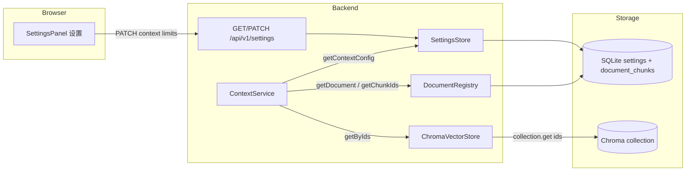

# Phase 5: Context Retrieval Core - Research

**Researched:** 2026-07-05
**Domain:** Chroma batch fetch, SQLite settings migration, bounded context retrieval service, Fastify settings API, React admin settings UI
**Confidence:** HIGH

## Summary

Phase 5 delivers `ContextService` with `readAround` and `readFile`, backed by the same `DocumentRegistry` + `ChromaVectorStore` corpus as `SearchService`, plus operator-configurable limits via SQLite settings and a Web admin 「设置」 tab. The codebase already has all integration anchors: `getChunkIds()` for ordered indices, `buildChunkId()` for Chroma IDs, `SettingsStore` single-row bootstrap, Fastify `/api/v1/*` routes with optional Bearer auth, and React admin panels in 简体中文.

The main new work is: (1) `ChromaVectorStore.getByIds()` wrapping `collection.get({ ids, include })`, (2) window clamp/shrink/truncation logic in `ContextService`, (3) structured `ContextError` types, (4) SQLite schema extension with **explicit ALTER migration** for existing deployments, (5) GET/PATCH settings routes, and (6) `SettingsPanel` grouped under 「上下文检索」 separate from 「分块」.

**Primary recommendation:** Implement `ContextService` as a thin orchestrator — registry validates document/index → slice ordered Chroma IDs → batch `collection.get` → re-sort by `chunk_index` → apply bounds — with live reads from `SettingsStore.getContextConfig()` on every call; do not hand-roll Chroma HTTP or custom error shapes.

<user_constraints>
## User Constraints (from CONTEXT.md)

### Locked Decisions

#### read_around window semantics
- **D-01:** `window` is **symmetric ±N** around `chunk_index` — e.g. center=4, window=2 → indices 2,3,4,5,6 (up to 2×window+1 chunks).
- **D-02:** Default `window` = **1**; maximum allowed `window` = **3**.
- **D-03:** Requests above max are **silently clamped** to max (no error). Response metadata includes `window_requested` and `window_applied`.
- **D-04:** At document boundaries, return as many chunks as exist (**shrink**); do not error. Response includes `chunk_range: { start, end }` (inclusive chunk indices actually returned).
- **D-05:** Chunks in response are ordered by **`chunk_index` ascending** (0,1,2…).
- **D-06:** The requested `chunk_index` (**center**) is **always included** when the document exists and the index is valid. Mark it with `is_center: true` on that chunk object.
- **D-07:** Each chunk returns **full stored text** from Chroma (not the 500-char search snippet). Whole-response size is still bounded (D-08).
- **D-08:** `read_around` total response character cap = **32_000** (configurable via admin settings). If exceeded, truncate from the **far end of the window** (highest/lowest index away from center first) and set truncation metadata.

#### Admin settings (grouped configuration)
- **D-09:** Context-retrieval limits are **operator-configurable** via Web admin (简体中文 UI), grouped under a dedicated section e.g. **「上下文检索」**, separate from ingestion chunk settings (**「分块」** or existing chunk group).
- **D-10:** Persist settings in SQLite `settings` table (extend schema alongside existing `chunk_size` / `chunk_overlap`), seeded from env defaults on first boot — same pattern as `settings-store.ts`.
- **D-11:** Configurable fields (minimum set):
  - `read_around_window_default` (default 1)
  - `read_around_window_max` (default 3)
  - `read_around_max_chars` (default 32000)
  - `read_file_max_chunks` (planner picks safe default, e.g. 50)
  - `read_file_max_chars` (planner picks safe default, e.g. 64000)
- **D-12:** Backend exposes **GET/PATCH `/api/v1/settings`** (or scoped sub-routes) for read/update; auth follows existing Bearer gate when `AUTH_ENABLED`.
- **D-13:** `ContextService` reads live settings from `SettingsStore` on each call (no restart required after admin save).

### Claude's Discretion

**Data fetch path**
- Use `DocumentRegistry.getChunkIds(documentId)` for ordered indices, then batch-fetch documents from Chroma by ID (`{documentId}:{chunkIndex}`). Add `getChunksByIds` (or equivalent) to `ChromaVectorStore` if missing.

**Errors (CORE-02)**
- Unknown `document_id` → structured error, **no partial chunks**.
- Out-of-range `chunk_index` → structured error, **no partial chunks**.
- Match existing MCP/backend JSON error style (clear `code` + `message` fields).

**read_file bounds**
- Return all chunks in `chunk_index` order with `read_file_max_chunks` and `read_file_max_chars` from settings; truncation metadata when limits hit.

**collection parameter**
- Optional `collection`, default `default` — same as `SearchService` / `search_knowledge`.

**Web UI placement**
- New settings panel or section in Web admin (Phase 4 shell); grouped fields with validation (max ≥ default, positive integers).

### Deferred Ideas (OUT OF SCOPE)

- MCP tool registration (`read_around`, `read_file`) — **Phase 6**
- REST parity endpoints for read tools (API-06) — future requirement, not Phase 5
- Hybrid BM25 / rerank / multi-collection — out of v1.1 scope
</user_constraints>

<phase_requirements>
## Phase Requirements

| ID | Description | Research Support |
|----|-------------|------------------|
| CORE-01 | Context retrieval reads chunk text from the same Chroma collection and document registry as `SearchService` | Reuse `DocumentRegistry.getChunkIds`, `ChromaVectorStore.getByIds` on same collection param, `buildChunkId` convention; no alternate corpus |
| CORE-02 | Invalid or unknown `document_id` / out-of-range `chunk_index` returns clear errors without partial data | `ContextError` thrown before any Chroma fetch on bad doc/index; validate against `getChunkIds().length` |
</phase_requirements>

## Architectural Responsibility Map

| Capability | Primary Tier | Secondary Tier | Rationale |
|------------|-------------|----------------|-----------|
| Window/range computation | API / Backend (`ContextService` in `@kb/core`) | — | Business logic belongs in shared core package; MCP (Phase 6) and future REST reuse it |
| Chroma batch fetch by ID | API / Backend (`ChromaVectorStore`) | Database / Storage (Chroma sidecar) | Vector store adapter owns Chroma protocol; sidecar persists embeddings + documents |
| Document/chunk index validation | API / Backend (`DocumentRegistry` + `ContextService`) | Database / Storage (SQLite) | Registry is source of truth for which chunk indices exist |
| Settings persistence | Database / Storage (SQLite `settings`) | API / Backend (`SettingsStore`) | Single-row SQLite table; services read on each call |
| Settings admin UI | Browser / Client (`SettingsPanel`) | API / Backend (GET/PATCH routes) | Operator configures limits in Web admin; backend validates and writes SQLite |
| Bearer auth on settings routes | API / Backend (Fastify `routeOpts`) | — | Same gate as documents/search when `AUTH_ENABLED` |

## Standard Stack

### Core

| Library | Version | Purpose | Why Standard |
|---------|---------|---------|--------------|
| `chromadb` | ^3.4.3 (project); npm latest **3.5.0** [VERIFIED: npm registry] | `collection.get({ ids })` batch fetch | Already used for upsert/query; official JS client |
| `better-sqlite3` | ^12.11.1 [VERIFIED: npm registry] | Settings schema + migration | Existing registry/settings pattern |
| `zod` | ^4.x via `zod/v4` [VERIFIED: codebase] | PATCH body validation | Matches `search.ts` route schemas |
| `vitest` | ^4.1.9 [VERIFIED: npm registry] | Unit tests with mocked Chroma/registry | Existing test harness in `@kb/core` and backend |

### Supporting

| Library | Version | Purpose | When to Use |
|---------|---------|---------|-------------|
| `@tanstack/react-query` | (existing in web) | Settings fetch/save | `useQuery` + `useMutation` in `SettingsPanel` |
| `fastify-type-provider-zod` | (existing in backend) | Typed GET/PATCH routes | Settings route registration |

### Alternatives Considered

| Instead of | Could Use | Tradeoff |
|------------|-----------|----------|
| `collection.get({ ids })` | `collection.query` with `ids` filter | Get is correct for ID lookup — no embedding needed [CITED: docs.trychroma.com] |
| `ALTER TABLE` migration | Drizzle/Knex migrations | Overkill for single-user v1.1; project defers ORM [CITED: 01-RESEARCH.md] |
| Monolithic GET/PATCH `/api/v1/settings` | Separate resource per group | Scoped PATCH `/api/v1/settings/context` keeps chunk settings read-only for now |

**Installation:** No new packages required — extend existing workspace dependencies.

## Architecture Patterns

### System Architecture Diagram



### Recommended Project Structure

```
packages/core/src/
├── context/
│   ├── context-service.ts    # readAround, readFile
│   ├── context-service.test.ts
│   ├── types.ts              # ReadAroundResult, ReadFileResult, ContextChunk
│   └── errors.ts             # ContextError class + codes
├── vector-store/
│   └── chroma-store.ts       # add getByIds()
├── registry/
│   ├── settings-store.ts     # getContextConfig, updateContextConfig, migrate
│   ├── schema.sql            # new columns + migration helper
│   └── types.ts              # ContextConfig
apps/backend/src/routes/
└── settings.ts               # GET /api/v1/settings, PATCH /api/v1/settings/context
apps/web/src/
├── api/settings.ts
└── components/SettingsPanel.tsx
```

### Pattern 1: Chroma Batch Get by IDs

**What:** Add `getByIds` to `ChromaVectorStore` calling `collection.get({ ids, include: ["documents", "metadatas"] })`.

**When to use:** Any time `ContextService` needs full chunk text for known Chroma IDs.

**Example:**

```typescript
// Source: https://docs.trychroma.com/docs/querying-collections/query-and-get
// Source: chromadb@3.4.0 collection.ts (cdn.jsdelivr.net/npm/chromadb@3.4.0/src/collection.ts)
async getByIds(params: GetByIdsParams): Promise<ChunkHit[]> {
  const { ids, collection } = params;
  if (ids.length === 0) return [];

  const col = await this.getOrCreateCollection(collection);
  const result = await col.get({
    ids,
    include: ["documents", "metadatas"],
  });

  // Build map — do NOT assume response order matches request order [ASSUMED: safer]
  const byId = new Map<string, ChunkHit>();
  for (let i = 0; i < result.ids.length; i += 1) {
    const id = result.ids[i];
    const meta = result.metadatas?.[i];
    byId.set(id, {
      documentId: String(meta?.document_id ?? ""),
      filename: String(meta?.filename ?? ""),
      chunkIndex: Number(meta?.chunk_index ?? 0),
      text: result.documents?.[i] ?? "",
    });
  }

  return ids
    .map((id) => byId.get(id))
    .filter((hit): hit is ChunkHit => hit !== undefined)
    .sort((a, b) => a.chunkIndex - b.chunkIndex);
}
```

**Key API facts [CITED: docs.trychroma.com]:**
- `get()` retrieves by ID without similarity ranking — correct for context expansion (not `query()`).
- Default `include` for get: `documents` + `metadatas`; omit `embeddings` to save bandwidth.
- Results are column-major: `ids[i]`, `documents[i]`, `metadatas[i]` align.
- `ids` are always returned; use `include` to control optional fields.
- Empty `ids` array: return `[]` without calling Chroma (guard in store).

### Pattern 2: SQLite Settings Schema Migration

**What:** Extend `settings` table with context columns; migrate existing DBs that only have `chunk_size` / `chunk_overlap`.

**When to use:** Every boot via `ensureSchema()` after `CREATE TABLE IF NOT EXISTS`.

**Problem:** `CREATE TABLE IF NOT EXISTS` does **not** add columns to an existing table [VERIFIED: codebase grep — no prior migration; 05-PATTERNS.md flags this].

**Recommended migration block:**

```typescript
// Source: SQLite ALTER TABLE ADD COLUMN semantics [ASSUMED: standard SQLite]
function migrateSettingsColumns(db: Database.Database): void {
  const columns = db
    .prepare("PRAGMA table_info(settings)")
    .all() as { name: string }[];
  const names = new Set(columns.map((c) => c.name));

  const additions: [string, number][] = [
    ["read_around_window_default", 1],
    ["read_around_window_max", 3],
    ["read_around_max_chars", 32000],
    ["read_file_max_chunks", 50],
    ["read_file_max_chars", 64000],
  ];

  for (const [col, defaultVal] of additions) {
    if (!names.has(col)) {
      db.exec(
        `ALTER TABLE settings ADD COLUMN ${col} INTEGER NOT NULL DEFAULT ${defaultVal}`,
      );
    }
  }
}
```

**Bootstrap order:**
1. `db.exec(loadSchemaSql())` — creates table with all columns on fresh install
2. `migrateSettingsColumns(db)` — adds missing columns on upgraded install
3. `seedSettingsIfMissing(db, config)` — INSERT row id=1 with env defaults if absent

**Seed INSERT** must include all columns (chunk + context) from `AppConfig` env vars.

**Env defaults to add** (mirror `CHUNK_SIZE` pattern in `packages/config/src/env.ts`):

| Env var | Default |
|---------|---------|
| `READ_AROUND_WINDOW_DEFAULT` | 1 |
| `READ_AROUND_WINDOW_MAX` | 3 |
| `READ_AROUND_MAX_CHARS` | 32000 |
| `READ_FILE_MAX_CHUNKS` | 50 |
| `READ_FILE_MAX_CHARS` | 64000 |

### Pattern 3: ContextService API Design

**Constructor / factory** — mirror `SearchService.create` + `IngestionService` settings dependency:

```typescript
export class ContextService {
  constructor(
    private readonly registry: DocumentRegistry,
    private readonly vectorStore: ChromaVectorStore,
    private readonly settingsStore: SettingsStore,
    private readonly defaultCollection: string = DEFAULT_COLLECTION,
  ) {}

  static create(config: AppConfig, deps: { ... }): ContextService { ... }

  async readAround(
    documentId: string,
    chunkIndex: number,
    options?: ReadAroundOptions,
  ): Promise<ReadAroundResult> { ... }

  async readFile(
    documentId: string,
    options?: ReadFileOptions,
  ): Promise<ReadFileResult> { ... }
}
```

**Return types:**

```typescript
export interface ContextChunk {
  documentId: string;
  filename: string;
  chunkIndex: number;
  text: string;
  isCenter?: boolean; // readAround only
}

export interface ReadAroundResult {
  documentId: string;
  filename: string;
  collection: string;
  chunkRange: { start: number; end: number }; // inclusive, actual returned
  windowRequested: number;
  windowApplied: number;
  truncated?: boolean;
  totalChars?: number; // optional metadata for debugging
  chunks: ContextChunk[];
}

export interface ReadFileResult {
  documentId: string;
  filename: string;
  collection: string;
  chunkCount: number; // total chunks in document (from registry)
  returnedChunks: number; // chunks actually in response
  truncated?: boolean;
  chunks: ContextChunk[];
}

export interface ReadAroundOptions {
  window?: number;
  collection?: string;
}

export interface ReadFileOptions {
  collection?: string;
}
```

**Validation order (fail fast, no partial data):**
1. `doc = registry.getDocument(documentId)` — if missing → `ContextError("document_not_found")`
2. `chromaIds = registry.getChunkIds(documentId)` — if empty or `chunkIndex < 0 || chunkIndex >= chromaIds.length` → `ContextError("chunk_index_out_of_range")`
3. Only then fetch from Chroma

**Collection resolution:** `options?.collection ?? doc.collection ?? defaultCollection` — prefer document's stored collection [VERIFIED: `DocumentRecord.collection` in registry types].

### Pattern 4: Window Clamp / Shrink / Truncation Algorithms

#### Window clamp (D-03)

```typescript
const settings = this.settingsStore.getContextConfig();
const windowRequested = options?.window ?? settings.readAroundWindowDefault;
const windowApplied = Math.min(windowRequested, settings.readAroundWindowMax);
// Silent clamp — expose both in response metadata
```

#### Boundary shrink (D-04)

```typescript
const start = Math.max(0, chunkIndex - windowApplied);
const end = Math.min(chromaIds.length - 1, chunkIndex + windowApplied);
const idsToFetch = chromaIds.slice(start, end + 1);
// chunkRange: { start, end } — inclusive chunk_index values
```

#### Character truncation — read_around (D-08)

**Goal:** Keep center chunk; remove furthest-from-center chunks first until `sum(text.length) <= readAroundMaxChars`.

```typescript
function truncateAroundCenter(
  chunks: ContextChunk[],
  centerIndex: number,
  maxChars: number,
): { chunks: ContextChunk[]; truncated: boolean } {
  let selected = [...chunks].sort((a, b) => a.chunkIndex - b.chunkIndex);
  let total = selected.reduce((sum, c) => sum + c.text.length, 0);
  if (total <= maxChars) return { chunks: selected, truncated: false };

  const byDistance = (c: ContextChunk) => Math.abs(c.chunkIndex - centerIndex);
  let truncated = false;

  while (total > maxChars && selected.length > 1) {
    // Removable: not center, or last resort if only center remains oversized
    const removable = selected.filter((c) => c.chunkIndex !== centerIndex);
    if (removable.length === 0) break; // center alone exceeds cap — keep it, mark truncated

    // Furthest from center first; tie-break higher index before lower
    removable.sort((a, b) => {
      const dist = byDistance(b) - byDistance(a);
      return dist !== 0 ? dist : b.chunkIndex - a.chunkIndex;
    });

    const toRemove = removable[0];
    total -= toRemove.text.length;
    selected = selected.filter((c) => c.chunkIndex !== toRemove.chunkIndex);
    truncated = true;
  }

  return {
    chunks: selected.sort((a, b) => a.chunkIndex - b.chunkIndex),
    truncated,
  };
}
```

**Post-fetch:** Set `isCenter: true` on chunk where `chunkIndex === centerIndex`.

#### read_file bounds

Apply limits in order:
1. Take all `chromaIds` in order (already sorted by `chunk_index` from registry)
2. **Chunk cap:** `ids.slice(0, readFileMaxChunks)`
3. Fetch from Chroma
4. **Char cap:** truncate from **tail** (highest indices) until under `readFileMaxChars`; set `truncated: true`, `returnedChunks < chunkCount`

```typescript
function truncateFromEnd(chunks: ContextChunk[], maxChars: number) {
  let selected = [...chunks];
  let total = selected.reduce((s, c) => s + c.text.length, 0);
  if (total <= maxChars) return { chunks: selected, truncated: false };

  while (total > maxChars && selected.length > 0) {
    const last = selected[selected.length - 1];
    total -= last.text.length;
    selected.pop();
  }
  return { chunks: selected, truncated: true };
}
```

### Pattern 5: Error Types (CORE-02)

**Core error class** (for Phase 6 MCP structured JSON):

```typescript
export type ContextErrorCode =
  | "document_not_found"
  | "chunk_index_out_of_range";

export class ContextError extends Error {
  constructor(
    public readonly code: ContextErrorCode,
    message: string,
  ) {
    super(message);
    this.name = "ContextError";
  }
}
```

| Condition | Code | HTTP (future REST) | MCP (Phase 6) |
|-----------|------|-------------------|---------------|
| Unknown `document_id` | `document_not_found` | 404 `not_found` | `{ code, message }`, no chunks |
| `chunk_index` out of range | `chunk_index_out_of_range` | 400 `bad_request` | `{ code, message }`, no chunks |

**Backend mapper** (extend `apps/backend/src/lib/errors.ts`):

```typescript
export function mapContextError(error: unknown): { statusCode: number; body: ErrorBody } {
  if (error instanceof ContextError) {
    if (error.code === "document_not_found") {
      return { statusCode: 404, body: { error: "not_found", message: error.message } };
    }
    return { statusCode: 400, body: { error: "bad_request", message: error.message } };
  }
  // ...
}
```

Matches existing `{ error, message }` shape [VERIFIED: `apps/backend/src/lib/errors.ts` lines 3-6, 51-61].

### Pattern 6: Backend GET/PATCH Settings Routes

**Analog:** `apps/backend/src/routes/search.ts` (Zod + type provider) + `documents.ts` (simple GET).

```typescript
// GET /api/v1/settings — read-only grouped response
app.get("/api/v1/settings", opts, async () => ({
  chunk: deps.settingsStore.getChunkConfig(),
  context: deps.settingsStore.getContextConfig(),
}));

// PATCH /api/v1/settings/context — update context group only
app.patch("/api/v1/settings/context", {
  ...opts,
  schema: { body: ContextSettingsSchema },
}, async (request, reply) => {
  const updated = deps.settingsStore.updateContextConfig(request.body);
  return { context: updated };
});
```

**Zod validation:**
- All fields positive integers
- `readAroundWindowMax >= readAroundWindowDefault` via `.refine()`
- Fastify global error handler returns `{ error: "validation_error", message }` on schema failure [VERIFIED: `apps/backend/src/index.ts` lines 65-74]

**Auth:** Pass `routeOpts` from `apiRouteOpts(config, app)` — same as documents/search [VERIFIED: `apps/backend/src/index.ts` lines 48-61].

**Wire in `index.ts`:** `registerSettingsRoutes(app, { settingsStore: services.settingsStore, routeOpts })`.

**Expose `settingsStore` on `AppServices`** — currently only used internally in `createAppServices`; routes need direct access.

### Pattern 7: Web Admin Settings Tab (简体中文)

**Tab addition** (`AppShell.tsx`):

```typescript
export type AppTab = "documents" | "search" | "settings" | "help";

const TABS = [
  { id: "documents", label: "文档" },
  { id: "search", label: "搜索" },
  { id: "settings", label: "设置" },
  { id: "help", label: "使用说明" },
];
```

**SettingsPanel sections (D-09):**

| Section | Label | Content |
|---------|-------|---------|
| Chunk (read-only for Phase 5) | 分块 | Display `chunkSize` / `chunkOverlap` from GET response |
| Context (editable) | 上下文检索 | Window default/max, max chars, read_file limits |

**Field labels (简体中文):**

| Field | Label | Help text |
|-------|-------|-----------|
| `readAroundWindowDefault` | 默认窗口 (±N) | 未指定时 read_around 使用的邻块数 |
| `readAroundWindowMax` | 最大窗口 (±N) | 请求超出时自动限制到此值 |
| `readAroundMaxChars` | read_around 最大字符数 | 超出时从窗口远端截断 |
| `readFileMaxChunks` | read_file 最大块数 | 超出时从文档末尾截断 |
| `readFileMaxChars` | read_file 最大字符数 | 超出时从文档末尾截断 |

**UI patterns to reuse [VERIFIED: codebase]:**
- `SearchPanel`: `useMutation`, `panel-stack`, `field`, `btn btn-primary`, `banner-error`
- `UploadPanel`: `banner-success` for save confirmation
- `api/client.ts`: Bearer auth + 401 retry — no changes needed

**Client validation before submit:** `readAroundWindowMax >= readAroundWindowDefault`; show `最大窗口必须大于或等于默认窗口`.

### Anti-Patterns to Avoid

- **Using `SearchService` or `query()` for ID lookup:** Requires embedding vector; use `get()` instead [CITED: docs.trychroma.com].
- **Truncating chunk text to 500 chars:** Search-only behavior; context tools return full Chroma text (D-07).
- **Returning partial chunks on validation failure:** Violates CORE-02; validate before Chroma fetch.
- **Relying on `CREATE TABLE IF NOT EXISTS` for new columns:** Existing v1.0 DBs won't get columns; must ALTER.
- **Caching settings in ContextService:** Violates D-13; read `getContextConfig()` per call.
- **Hard-coding bounds without admin UI:** Violates D-09/D-11; env seeds defaults only.

## Don't Hand-Roll

| Problem | Don't Build | Use Instead | Why |
|---------|-------------|-------------|-----|
| Chroma get-by-ID HTTP | Raw fetch | `chromadb` `collection.get({ ids })` | Typed client, include flags, heartbeat already wired |
| Settings ORM/migrations | Drizzle/Knex | `PRAGMA table_info` + `ALTER TABLE` | Matches v1.0 scaffold decision |
| Custom error JSON shape | Ad-hoc strings | `ContextError` + `{ error, message }` mapper | MCP Phase 6 + backend consistency |
| Window math from search hits | Re-query Chroma by metadata | `getChunkIds` slice + `getByIds` | Registry owns ordering; same corpus as ingest |
| React settings state cache | Global store | TanStack Query `["settings"]` key | Matches SearchPanel mutation/invalidate pattern |

**Key insight:** Context retrieval is orchestration over existing registry + Chroma adapters — complexity lives in bounds/truncation logic and migration, not new infrastructure.

## Common Pitfalls

### Pitfall 1: Chroma Get Response Order

**What goes wrong:** Assuming `result.documents[i]` aligns with `params.ids[i]` when some IDs are missing.

**Why it happens:** Get returns only found records; order may not match request [ASSUMED — verify in integration test].

**How to avoid:** Build `Map<id, ChunkHit>` from response, then iterate requested IDs in chunk_index order.

**Warning signs:** Chunks appear out of order or center chunk missing despite valid index.

### Pitfall 2: SQLite Schema Upgrade on Existing Deployments

**What goes wrong:** `getContextConfig()` SQL fails with "no such column" on v1.0 databases.

**Why it happens:** `CREATE TABLE IF NOT EXISTS` skips existing table definition.

**How to avoid:** Run `migrateSettingsColumns()` after schema load on every boot.

**Warning signs:** Backend crash on startup after pull; settings GET 500.

### Pitfall 3: Center Chunk Dropped During Truncation

**What goes wrong:** Character cap removes center chunk, breaking D-06.

**Why it happens:** Naive pop-from-end truncation applied to read_around window.

**How to avoid:** Never remove center until only center remains; use distance-based removal.

**Warning signs:** `is_center` chunk absent from response for valid index.

### Pitfall 4: Collection Mismatch

**What goes wrong:** Document in collection `archive` but fetch uses `default`.

**Why it happens:** Ignoring `DocumentRecord.collection`.

**How to avoid:** Resolve collection as `options?.collection ?? doc.collection ?? defaultCollection`.

**Warning signs:** Empty Chroma results for known document ID.

### Pitfall 5: Settings PATCH Without Validation

**What goes wrong:** `window_max < window_default` persisted; ContextService clamp behaves unexpectedly.

**Why it happens:** Missing Zod `.refine()` and client-side check.

**How to avoid:** Validate in Zod schema + SettingsPanel before submit + optional store-level guard.

**Warning signs:** Admin saves invalid combo; silent clamp to max only applies to requests not defaults.

## Code Examples

### Chroma collection.get (batch by IDs)

```typescript
// Source: https://docs.trychroma.com/docs/querying-collections/query-and-get
const result = await collection.get({
  ids: ["doc-1:0", "doc-1:1", "doc-1:2"],
  include: ["documents", "metadatas"],
});

for (const row of result.rows()) {
  console.log(row.id, row.document, row.metadata);
}
```

### Settings store getter

```typescript
// Pattern: packages/core/src/registry/settings-store.ts getChunkConfig
getContextConfig(): ContextConfig {
  return this.db.prepare(`
    SELECT
      read_around_window_default AS readAroundWindowDefault,
      read_around_window_max AS readAroundWindowMax,
      read_around_max_chars AS readAroundMaxChars,
      read_file_max_chunks AS readFileMaxChunks,
      read_file_max_chars AS readFileMaxChars
    FROM settings WHERE id = 1
  `).get() as ContextConfig;
}
```

### ContextService readAround orchestration

```typescript
// Validate → clamp → shrink → fetch → sort → truncate → annotate center
const settings = this.settingsStore.getContextConfig();
const windowRequested = options?.window ?? settings.readAroundWindowDefault;
const windowApplied = Math.min(windowRequested, settings.readAroundWindowMax);

const start = Math.max(0, chunkIndex - windowApplied);
const end = Math.min(chromaIds.length - 1, chunkIndex + windowApplied);
const hits = await this.vectorStore.getByIds({
  ids: chromaIds.slice(start, end + 1),
  collection,
});

const { chunks, truncated } = truncateAroundCenter(
  hits.map((h) => ({ ...h, isCenter: h.chunkIndex === chunkIndex })),
  chunkIndex,
  settings.readAroundMaxChars,
);
```

## State of the Art

| Old Approach | Current Approach | When Changed | Impact |
|--------------|------------------|--------------|--------|
| Search snippets only (500 chars) | Full chunk text via `get()` | Phase 5 | Context tools return readable passages |
| Hard-coded bounds | SQLite + admin UI | Phase 5 | Operators tune without redeploy |
| No context service | `ContextService` in `@kb/core` | Phase 5 | Phase 6 MCP tools consume shared service |

**Deprecated/outdated:**
- None in this phase — extends existing v1.0 stack.

## Assumptions Log

| # | Claim | Section | Risk if Wrong |
|---|-------|---------|---------------|
| A1 | Chroma `get({ ids })` may omit missing IDs rather than return null placeholders | Pattern 1 | Index-based mapping breaks; Map-by-id mitigates |
| A2 | `read_file_max_chunks=50` and `read_file_max_chars=64000` are safe defaults | User Constraints | May truncate large docs aggressively; operator can raise via admin |
| A3 | SQLite `ALTER TABLE ADD COLUMN ... DEFAULT` backfills existing row id=1 | Pattern 2 | Migration test on v1.0 DB snapshot required |
| A4 | Prefer `doc.collection` over request default when option omitted | Pattern 3 | Wrong collection if document moved between collections (edge case) |

## Open Questions

1. **Should PATCH also allow editing chunk settings (分块)?**
   - What we know: D-09 separates groups; chunk settings exist in SQLite; Phase 5 scope is context group only.
   - What's unclear: Whether chunk group stays read-only in UI forever.
   - Recommendation: Phase 5 — display chunk settings read-only; PATCH only `/api/v1/settings/context`.

2. **Center chunk alone exceeds `read_around_max_chars` — truncate text or return full center?**
   - What we know: D-06 requires center included; D-08 bounds total response.
   - Recommendation: Return full center text, set `truncated: true`; do not split chunk text (matches "full stored text" intent).

## Environment Availability

| Dependency | Required By | Available | Version | Fallback |
|------------|------------|-----------|---------|----------|
| Node.js | Build/test | ✓ | (project standard) | — |
| Chroma sidecar | `getByIds` integration | ✓ (v1.0 stack) | — | Unit tests mock Collection |
| SQLite (`SQLITE_PATH`) | Settings + registry | ✓ | via better-sqlite3 12.11.1 | — |
| CherryIn API | Not Phase 5 | — | — | ContextService needs no embeddings |

**Missing dependencies with no fallback:** None for Phase 5 unit tests (mocked Chroma).

## Security Domain

### Applicable ASVS Categories

| ASVS Category | Applies | Standard Control |
|---------------|---------|-----------------|
| V2 Authentication | yes | Bearer auth on settings routes when `AUTH_ENABLED` |
| V3 Session Management | no | Stateless Bearer per request |
| V4 Access Control | yes | Same API key gate as documents/search |
| V5 Input Validation | yes | Zod schemas on PATCH; positive integer bounds |
| V6 Cryptography | no | No new crypto in this phase |

### Known Threat Patterns

| Pattern | STRIDE | Standard Mitigation |
|---------|--------|---------------------|
| Unauthenticated settings tampering | Elevation | `@fastify/bearer-auth` via `routeOpts` |
| Oversized PATCH payload | DoS | Zod max bounds on integer fields |
| SQL injection via settings | Tampering | better-sqlite3 prepared statements only |

## Sources

### Primary (HIGH confidence)
- [CITED: docs.trychroma.com/docs/querying-collections/query-and-get] — `collection.get({ ids })`, include flags, result shape
- [CITED: cdn.jsdelivr.net/npm/chromadb@3.4.0/src/collection.ts] — TypeScript `get()` signature and defaults
- [VERIFIED: codebase] — `chroma-store.ts`, `search-service.ts`, `settings-store.ts`, `document-registry.ts`, backend routes, web admin

### Secondary (MEDIUM confidence)
- [CITED: cookbook.chromadb.dev/core/collections] — column alignment, batch get patterns
- [VERIFIED: npm registry] — chromadb 3.5.0, better-sqlite3 12.11.1, vitest 4.1.9

### Tertiary (LOW confidence)
- Chroma get return order for partial ID matches — flagged A1; mitigate with Map-by-id

## Metadata

**Confidence breakdown:**
- Standard stack: HIGH — existing dependencies, verified Chroma get API
- Architecture: HIGH — patterns mapped in codebase and 05-PATTERNS.md
- Pitfalls: MEDIUM — truncation edge cases and Chroma partial-get behavior need unit tests

**Research date:** 2026-07-05
**Valid until:** 2026-08-05 (stable stack; chromadb may patch faster)

## RESEARCH COMPLETE

**Phase:** 5 - Context Retrieval Core
**Confidence:** HIGH

### Key Findings
- Use `collection.get({ ids, include: ["documents", "metadatas"] })` — not `query()` — for batch chunk text fetch; map results by ID then sort by `chunk_index`.
- Existing v1.0 SQLite DBs require `PRAGMA table_info` + `ALTER TABLE ADD COLUMN` migration; `CREATE TABLE IF NOT EXISTS` alone is insufficient.
- `ContextService` validates doc/index before any Chroma call; `ContextError` with `document_not_found` / `chunk_index_out_of_range` codes satisfies CORE-02.
- read_around truncation removes furthest-from-center chunks first while preserving center (D-06); read_file truncates from document tail.
- Backend: GET `/api/v1/settings` + PATCH `/api/v1/settings/context` with Zod validation and existing Bearer `routeOpts`; Web: new 「设置」 tab with 「上下文检索」 group in 简体中文.

### File Created
`.planning/phases/05-context-retrieval-core/05-RESEARCH.md`

### Confidence Assessment
| Area | Level | Reason |
|------|-------|--------|
| Standard Stack | HIGH | Verified Chroma docs + npm + existing chromadb ^3.4.3 |
| Architecture | HIGH | All integration points exist in codebase |
| Pitfalls | MEDIUM | Truncation edge cases + Chroma partial ID behavior need tests |

### Open Questions
- Chunk settings edit scope deferred (read-only display recommended for Phase 5)
- Center-only oversize chunk: return full center with `truncated: true`

### Ready for Planning
Research complete. Planner can now create PLAN.md files.
